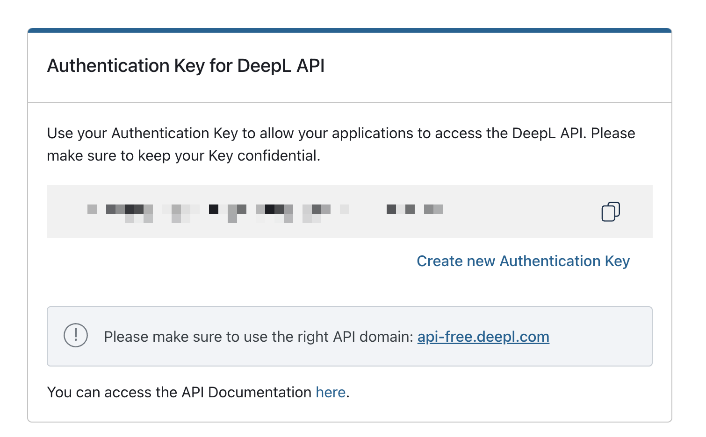
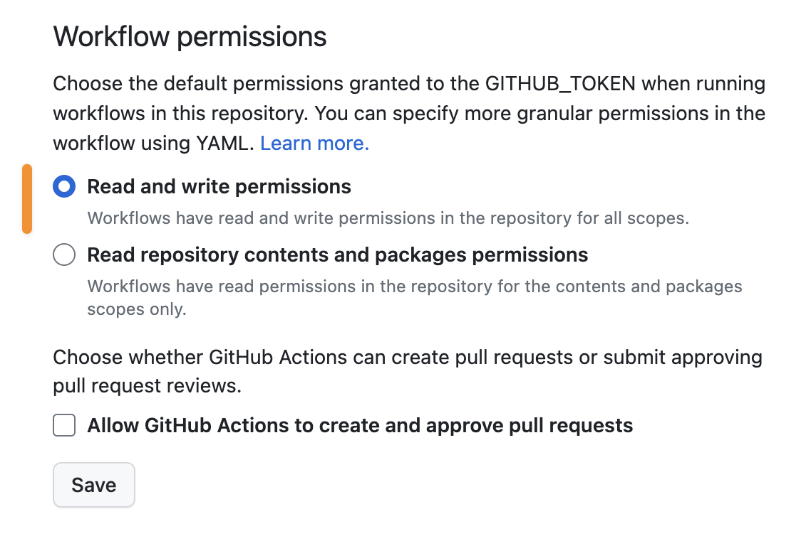

# DeepL Translate Github Action for Multiple JSON Files


## Intro

This action uses the [DeepL Translate API](https://github.com/DeepLcom/deepl-node) to translate multiple JSON files in the same directory

## Inputs

| Name                       | Description                                                                                                                                                                                       | Required |
| -------------------------- | ------------------------------------------------------------------------------------------------------------------------------------------------------------------------------------------------- | :------: |
| `deepl_api_key`            | API Key for DeepL API                                                                                                                                                                             |   yes    |
| `target_languages`         | Target languages to translate to. Refer to [DeepL docs for language codes](https://www.deepl.com/docs-api/translate-text). You can also input `all` for all target languages that DeepL supports. |   yes    |
| `input_folder_path`          | Path of the folder containing the json files to translate                                                                                                                   |   yes    |
| `input_file_names`   | comma separated list of file names to translate, it also accepts a `*.json` to indicate that all files and target folder should be translated                                                                                                    |    yes    |
| `output_file_name_pattern` | Output file name pattern. e.g: `public/locales/{language}/common.json` where language is replaced by the target language code, if the file name at the end is replaced with {base} uses the same fileName that was received                                                                  |    yes    |
## Example usage

```yaml
name: Translate documents from docs/simple folder
on:
  workflow_dispatch:
  pull_request:
    types: [opened, synchronize]

jobs:
  build:
    runs-on: ubuntu-latest
    steps:
      - name: DeepL Translate Github Action Multiple JSON Files
        uses: leonelzambroni/deepl-translate-github-action@0.1.0
        with:
          target_languages: zh,ja
          input_file_path: docs/simple/en/
          input_file_names: file1.json, file2.json
          output_file_name_pattern: docs/simple/{language}/{base}
          deepl_api_key: ${{ your_deepl_api_key }}
```

With this workflow, you will get `docs/simple/zh/file1.json`, `docs/simple/zh/file2.json`, `docs/simple/ja/file1.json`  and `docs/simple/ja/file2.json`


## FAQ

<details><summary>How to get DeepL API Token</summary>

First, you need to [sign up for the free DeepL API plan](https://www.deepl.com/docs-api). Then you can go to https://www.deepl.com/account/summary and retrieve your token there.



</details>

<details><summary>If you don't have an existing GitHub Action workflow for your repository</summary>

1. Create a folder `.github/workflows` if you don't have it already
2. Inside that folder, create a YAML file say `translate.yml`
3. In the `translate.yml` file, you can copy the example below and modify it to your usage.
</details>

<details><summary>Why am I getting an error of "Permission to git denied to github-actions[bot]"</summary>

You have to set the workflow permissions under Repository Settings > Actions > Workflow permissions to be **"Read and write permissions"**.



</details>
